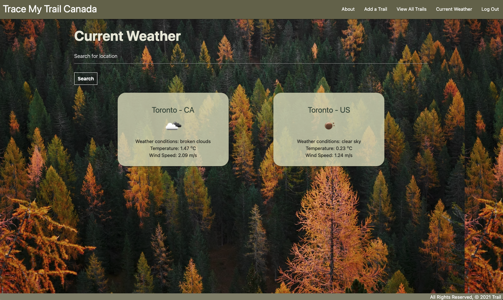

# App Title: Trace My Trail Canada

You can trace the trail you have been to, fill out the trail informations, and organize what activities you can do.

You can also make plans in advance by filling out your trail information.

By providing weather information, you can find weather information where you want to visit.

## Screenshot(s):

## Technologies Used:

Django, Python, PostgreSQL, Bootstrap, HTML, CSS, Heroku

## Getting Started:

Heroku: [Click](main_app/https://trailcollector.herokuapp.com/)

## Next Steps:

- Upload images/assets to AWS S3
- Consume data from a third-party API - eg. picture api
